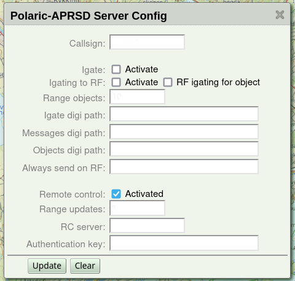
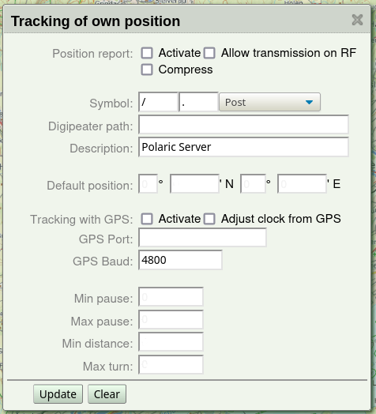

 
Basic setup of Polaric APRSD
============================

The most important settings can be done via the web-interface. You will need to log-in with *admin* (superuser) rights. The package initially comes with an admin-user (*‘admin’*) with password *‘polaric’*. **Important**: You should of course change this password as soon as possible. You may use the command shell to do this::

    sudo polaric-passwd admin

You will be prompted twice for new password. You may also change your password using the webapp. 

After you have installed *webapp2*, and this is up and running, you can use your web-browser to see the map and some menus. You can click the icon which looks like a lock. Log on with username and password. If this succeeds, the window will show that you are logged in (and the lock icon will become green). To change your password, see the menu: *'Set/change password'*. Note that any user can change his/her own password. The superuser (*'admin'*) can change password of any other user as well. If you have superuser rights, you can click the main menu and select *'System admin'* and another menu pops up with the following choices: 

* *Status info* (see info about running system and connected clients)
* *User admin* (manage user-accounts)
* *Server config* (Basic server onfiguration)
* *Own pos config* (Use server as a position tracker)
* *Channels config* (set up channels)
* *Clear all items* (delete all position-items on the map).
* *Synch nodes* (experimental: synchronisation between instances). Only visible if you use the database-plugin. 

Basic server settings
---------------------

If you choose *'Server Config'* in the menu, you will now see a set of fields that can be filled in or changed. They are fairly self-explanatory. **Important:** If you haven't set the callsign yet, now is a good time. 'NOCALL' is default but should set your own! The other settings are more optional. They are as follows:

* **Igate settings**. *Polaric-aprsd* is capable of running as a igate if required. If you set up the server with both internet and TNC/Radio it *may* be useful to activate the igate. *Don't activate it if you don't need it*. The igate use the channels which are marked as the primary RF and APRS-IS channels (in channel-setup). Make sure that these channels are correctly configured *before* you activate the igate.

* **Object settings**. Some settings for transmission of object-reports. You can set the *range* from the server's position where object reports are transmitted or igated to RF (relevant if igating is on), you can turn on encryption of object-reports or (optionally) set an alternative digipeater path. 

* **Connection to another Polaric Server instances** (over APRS) for remote control, synchronization of SAR information (alias, tags, etc..) and personal text-messages. Servers to be connected, need to agree on a *common secret* (key for encryption and authentication). We can also specify to which servers *messages* are to be *encrypted* (regular expression). 

When you are done with settings on this page, click *'Update'* and you can move on to another set of settings. 

Configuration of data channels
------------------------------

You see a list of channels and the running status of those. You may delete or add channels. Or you may click the edit-icon to see more detailed info and edit settings of the channel. 

There are two different types of APRS-channels: *Radio*-channels and *Internet* (non-radio) channels. In addition, plugins may add *Non-APRS* channels, for example AIS. What fields to fill inn depends on the *type*. If clicking on the *edit* icon on the channel list, the relevant fields are shown. If the channel is active, it will also show some statistics like number of received packets. Up to two channels may be marked as *primary*: One Internet-channel and one radio-channel. This is needed when igate is activated or the server needs to send out things on APRS. Channels that are not primary are normally receive-only. Press '*New*' button to create a new channel (choose a name and type first), fill inn the necessary information. and press *'Add'* to save it. 

The available Internet APRS channel types are: 

* ``APRSIS`` - Connect to an APRS-IS server over the internet
* ``APRSIS-SRV`` - Act as an APRS-IS *server* on a specific port so that e.g. igates can connect. 
* ``ROUTER`` - A special channel that can be connected to APRSIS or APRSIS-SRV channels (with a filter for each) and act as *APRS-router*. A router-channel can be used as a primary channel. Packets sent to a primary router will be sent on all connected channels depending on filters. Filters in the router-setup decide what go to the connected channels. For each connected channel (APRSIS or APRSIS-SRV) you can set up filters for incoming traffic, so it is possible to configure it as a kind if '*firewall*' for APRS-traffic. 

*APRS-IS server and router channels are available from version 3.2 (or later) of Polaric Server.* 

One APRS-IS channel (aprsIS) is already set up and activated. The channel may for example use the server *`aprs.no`*, port 14580. There are also protected ports available for NRRL-members. 'Users in other countries should change the APRS-IS server to what is best suited in their area. You should also add a *passcode* which will allow you to send data to APRS-IS as well. This code can be generated based on your *callsign*. There are programs or services on the net that can generate a passcode for you if you have a valid callsign. You should also set a filter expression that says more specifically what you want from the APRS-IS server. The filter should be set to accept data from your geographical area of interest or types of data you need. Note that this filter is necessary if you use the general port 14580. `See more information <https://polaricserver.readthedocs.io/en/latest/aprs-filters.html>`_ about server filters. In addition to the filter to be sent to the server we can (from v.4.0) also specify an internal filter for incoming packets. Use '*' to accept all, possibly with exception filters to block unwanted traffic. 

The *radio* channel is not activated by default and can be removed if you don't need it. If you need to use a TNC or a radio with builtin APRS, you can configure and activate a radio channel.

* **Type**: ``TNC2`` for TNC2 compatible TNC. Use this for Kenwood radios with builtin APRS. Use ``KISS`` for TNCs in KISS mode. It is also possible to use ``TCPKISS`` (KISS over internet). 
    
* **Port**: Serial port or USB-serial port, as they are named in Linux. For instance, *`/dev/ttyS0`* would correspond to the COM1 serial port. If you plug in a USB serial converter or a radio with a USB plug, the port name will typically *`/dev/ttyUSB0`* or *`/dev/ttyACM0`* depending on what hardware is used. One way to find out what port-name is assigned to a USB device is to type *'dmesg'* in the command shell after the device is plugged in to look at the system log.

* **Baud-rate** for serial port.

If type is ``TCPKISS``, you fill in the IP-address (or server host name) and a port number. ``TCPKISS`` is useful e.g. if using *Polaric-aprsd* along with programs like *Direwolf*. Actually, it may be used to access any TNC over a serial device, using a serial to network proxy like *ser2net* or *tcptty*. This can be more flexible and reliable than using the serial port directly from Polaric-aprsd.   

Positioning
-----------

*Polaric-aprsd* can be set up to send position reports like a tracker. It will only send such reports on the primary internet channel (APRSIS, APIRSIS-SRV or ROUTER) unless you explicitly allow it to send it on RF. Position reports can be encrypted and you can choose if encryption is to be used on RF as well as on APRS-IS. A digipeater path would be used on RF. You may use a GPS on a serial port and you may also use the NMEA packets from the GPS to adjust the clock. If GPS is not used or if it doesn't get a fix, we may use a default fixed position. 

A smart-beaconing algorithm will be used if the position changes. The frequency of the reporting will depend on the speed and direction of the movement. *Min-pause* is the minimum time between transmissions. *Max-pause* is the maximum time between transmissions. *Min-distance* is the distance (should perhaps be called max-distance) moved before a transmission is generated and max-turn is the maximum change in direction before a transmission is generated. 

Encryption
----------
From version 4.1. *Polaric Aprsd* support *encryption* of messages (internal and personal messaging) and position reports to be able to satisfy security requirements in emergency communicato when the APRS-IS network sends everything worldwide and has no security. Radio amateur regulations typically don't allow using encryption on RF, so you should be careful in configuring this. In some countries, in some situations, however, encryption on RF may be legal. 

We use AES-256, a strong symmetric encryption which also authenticates the content. See more here `how this is done for messaging <#for messaging>`_ and `for position reports <#encrypted-aprs-position-reports>`_. The key can be set in the server-config window and should be secret and not too short. It can be a passphrase. It must be the same on all servers that are to take part in the encrypted communication. The key is also used when just `authenticating messages <#authenticated-aprs-messages>`_. 

To activate the settings
------------------------

For each page of settings click the *'Update'* button to save your changes (or *'Add'* to save a new channel). Changes to channels will take effect immediately. If a restart is necessary, it will be indicated.  
